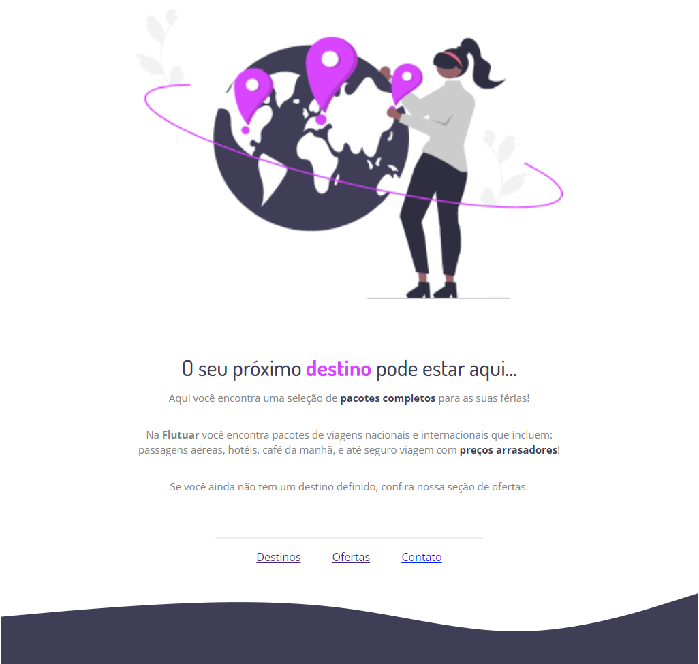

<h1 align="center"> Projeto Flutuar </h1>

  <a href="#🚀-tecnologias">Tecnologias</a>&nbsp;&nbsp;&nbsp;|&nbsp;&nbsp;&nbsp;
  <a href="#💻-projeto">Projeto</a>&nbsp;&nbsp;&nbsp;|&nbsp;&nbsp;&nbsp;
  <a href="#memo-licença">Licença</a>

  

 

  

## 🚀 Tecnologias

Esse projeto foi desenvolvido com as seguintes tecnologias:

- HTML e CSS
- Git e Github
- Figma

## 💻 Projeto

Apenas um projeto de uma pagina simples simulando que seja para uma empresa que venda pacotes de viagem!

- [Acesse o projeto finalizado, online](https://thiagocaltoe.github.io/ProjetoFlutuar/)

## :memo: Licença

Esse projeto está sob a licença MIT.

---

Feito com ♥ by Thiago Costa :wave:
